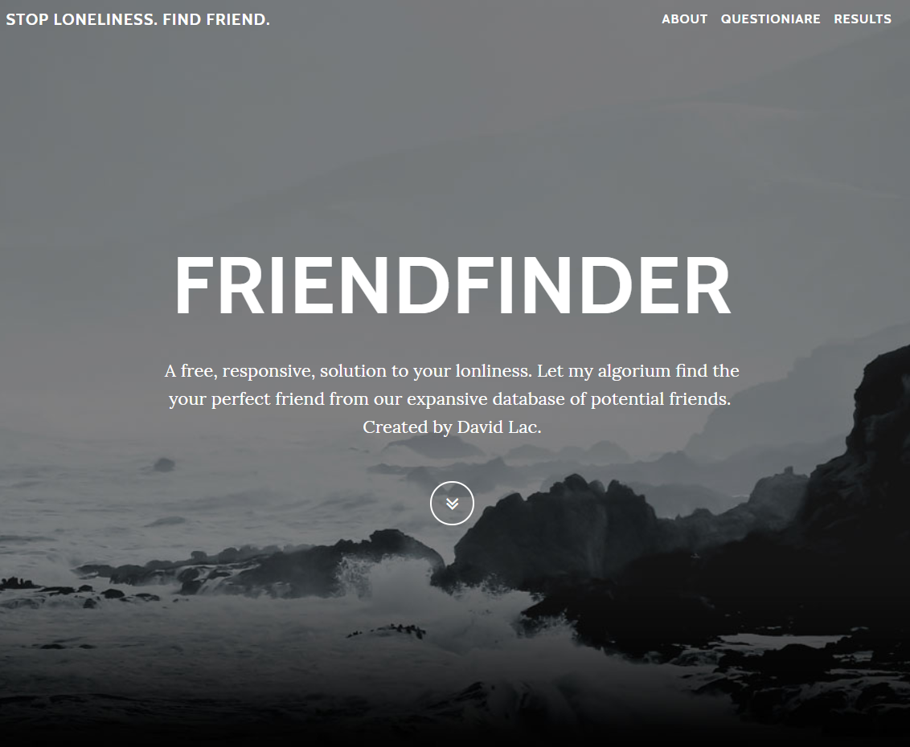
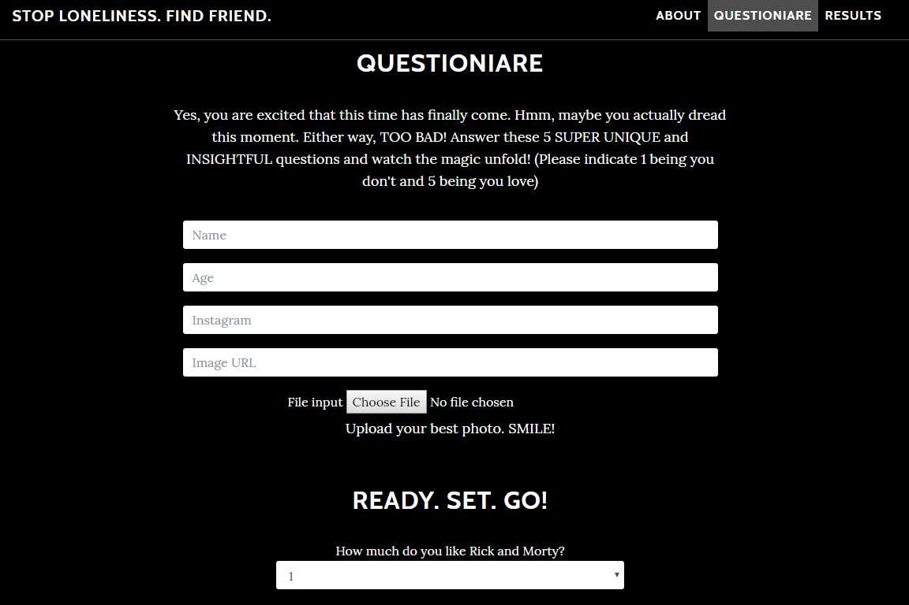

# FriendFinder

## Overview
Look for a friend from a database of users. Users fill out a simple survey and upon completion, this app compares their answers with other users. The app then displays and match them with the user determined to be most compatible.

## Tools Used
1. Node.js
2. Express.js
3. Heroku

## DEMO
[https://davidsfriendfinder.herokuapp.com/](https://davidsfriendfinder.herokuapp.com/)
